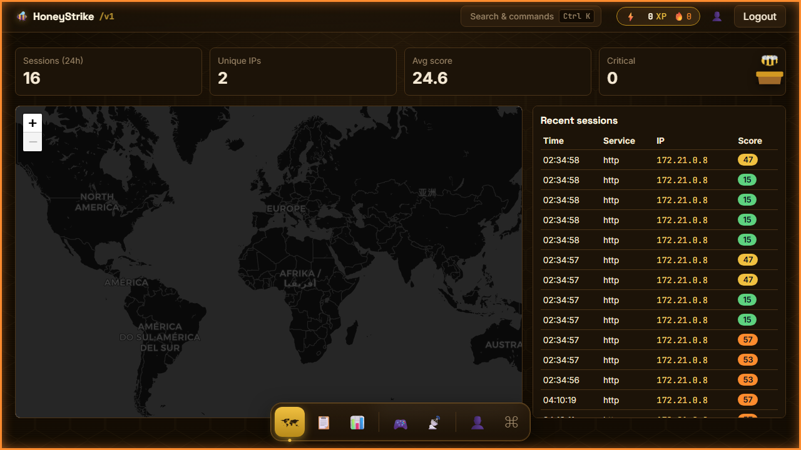
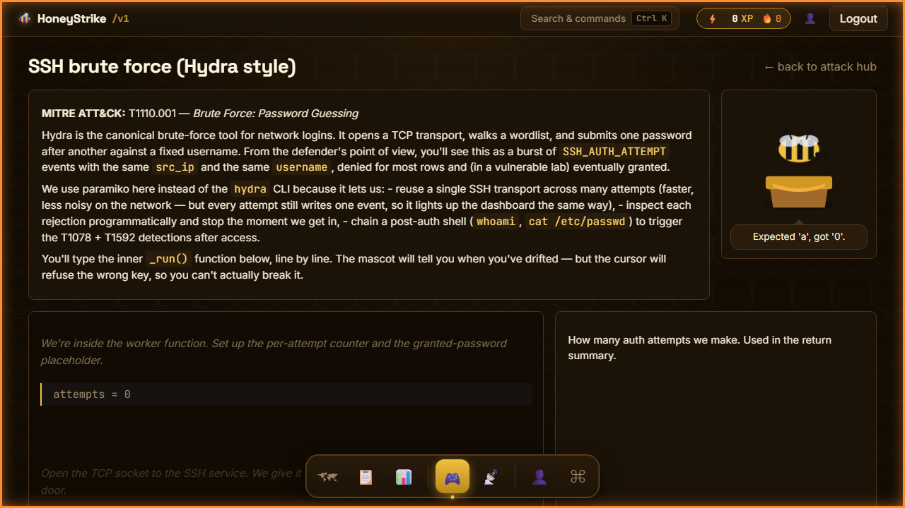
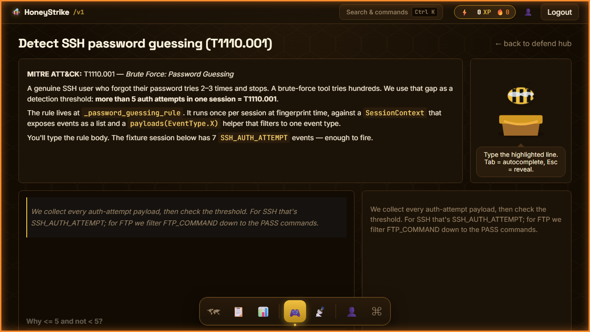
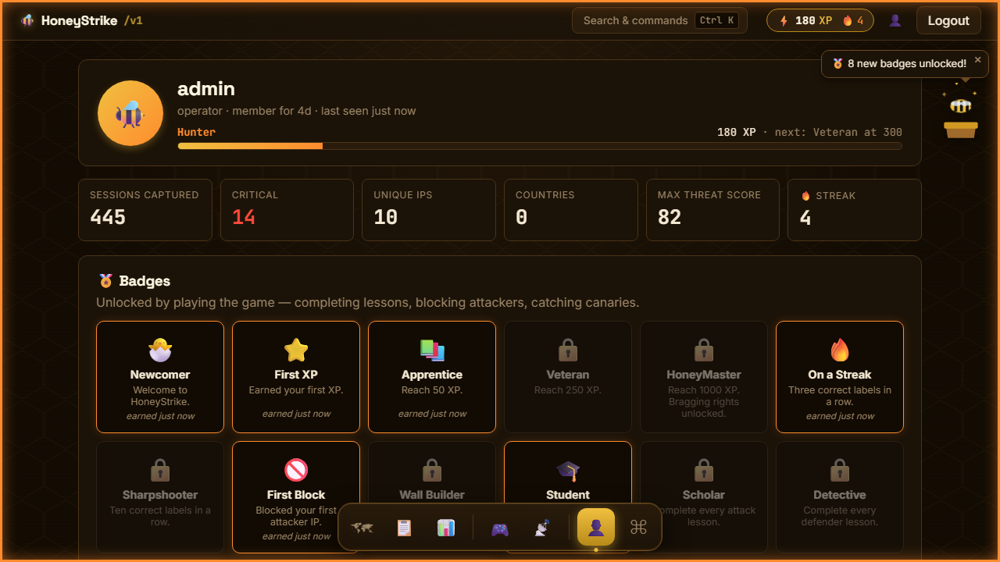
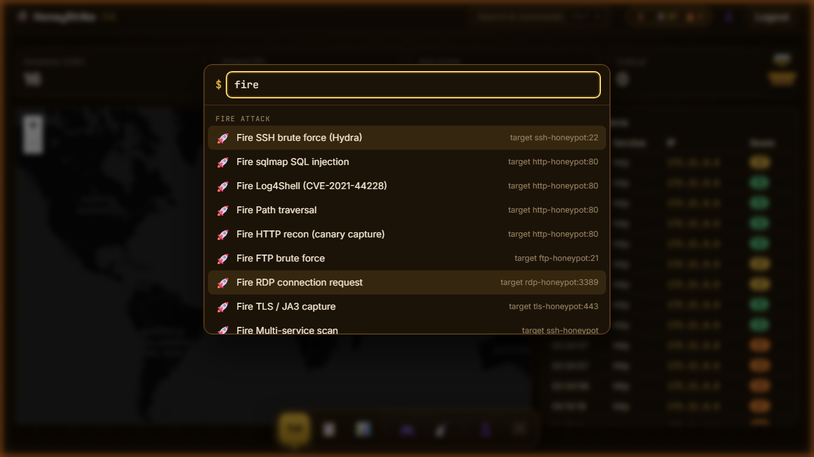
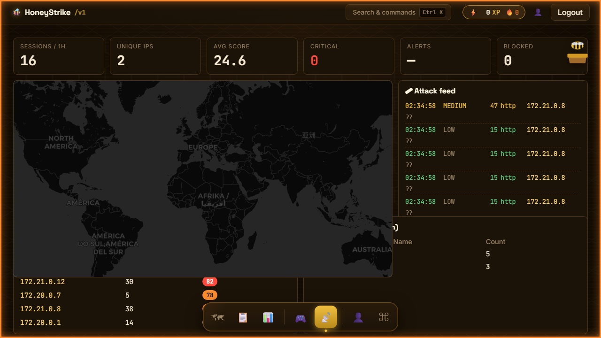
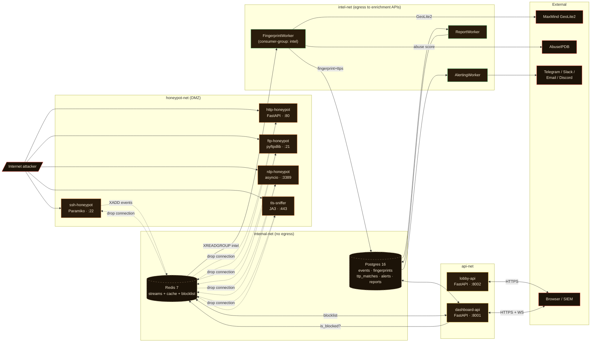

<div align="center">

# 🐝 HoneyStrike

### *A multi-protocol honeypot platform with a learning game on top.*

Capture real attackers across **SSH / HTTP / FTP / RDP / TLS / Telnet / SMTP / Redis**, enrich every session with **geo-IP + abuse reputation + tool fingerprint + MITRE ATT&CK attribution + threat score**, send alerts, render PDF reports, and let your operators **learn to attack and defend by typing real code** — all in one `docker compose up -d`.

[](https://github.com/AlexMatei1/honey-strike/actions/workflows/ci.yml)


</div>

---

## Table of contents

- [Why](#why)
- [What's inside](#whats-inside)
- [Live screenshots — the dashboard tour](#live-screenshots--the-dashboard-tour)
- [Architecture](#architecture)
- [Data flow — what happens when an attacker connects](#data-flow--what-happens-when-an-attacker-connects)
- [Tech stack](#tech-stack)
- [Quick start (development)](#quick-start-development)
- [Production deploy](#production-deploy)
- [Project layout](#project-layout)
- [API surface](#api-surface)
- [`honeystrike` CLI](#honeystrike-cli)
- [The learning platform (Phase 7)](#the-learning-platform-phase-7)
- [Multiplayer (Phase 6)](#multiplayer-phase-6)
- [Testing](#testing)
- [Roadmap & phases](#roadmap--phases)
- [Security](#security)
- [Acknowledgements](#acknowledgements)

---

## Why

Most honeypots stop at "log the bytes." HoneyStrike is built around a different idea: **what you capture is only useful if you can read it, score it, and act on it within seconds.**

So the platform is end-to-end:

1. **Convincing** fake services that respond well enough to make real scanners + brute-force tools commit to a session.
2. **Enrichment pipeline** that turns raw events into ranked, attributed sessions in <2 s.
3. **Operator-grade UI**: live attack map, session detail with replay scrubber, PDF reports, STIX 2.1 / TAXII 2.1 feed for SIEMs.
4. **Game layer**: an operator who has *typed* the Hydra brute-force loop themselves recognises it on the dashboard at a glance.

The result is one repo that works as a production honeypot, a SOC training platform, and a competitive attack/defend game between friends running their own instances.

> **Deployable to a €4/month VPS.** 2 vCPU / 4 GB RAM is enough for the full stack.

---

## What's inside

<table>
<tr>
<td width="50%" valign="top">

### 🎣 Capture layer
- **8 honeypot listeners** (SSH, HTTP, FTP, RDP, TLS-sniffer, Telnet, SMTP, Redis)
- Convincing canned responses + **3 CTF-style canary tokens** (fake AWS key, fake /etc/passwd entry, fake admin token)
- Per-IP rate limiting; granted-after-N policy on SSH

### 🔬 Intelligence pipeline
- **Geo-IP + AbuseIPDB** lookups, cached in Redis
- **7 tool-signature rules** (Hydra, sqlmap, Nikto, Masscan, …)
- **7 MITRE ATT&CK rules** (T1110.001 / T1110.004 / T1190 / T1083 / T1592 / T1595.001 / T1078)
- **Threat-score formula** (abuse 40% + tools 30% + TTPs 50% + privilege bonus)
- **ML anomaly score** (Isolation Forest, sklearn) for outlier detection
- **STIX 2.1 bundle** + **TAXII 2.1 root** for SIEM ingest

### 📣 Output layer
- **Alerts** to Telegram, Slack, email, Discord, structured log
- **PDF / HTML reports** per session (WeasyPrint)
- **REST API + WebSocket live feed** (`/api/ws/live`)

</td>
<td width="50%" valign="top">

### 🖥 Operator dashboard
- Live world-map of attacks (Leaflet) with severity-colored markers
- Sessions list + filters (service, severity, time)
- Per-session detail page with timeline, payload preview, TTPs, alerts
- **🎬 Replay theater** — animated playback of a captured session
- **📡 War Room** — full-screen takeover view for demos
- 👤 **Profile** with rank, XP, **15 badges**, lesson progress, activity log

### 🎮 Learning platform
- **5+ typing lessons** that walk you through writing real attack runners or detector rules
- Animated **mascot reactions** on every keystroke (correct / wrong / sleep)
- Defender lessons run the reference rule against a fixture and **grade your guess**
- **Fire-live button**: launch the attack you just typed at your own honeypot
- **Command palette (⌘K)** to jump anywhere, fire any scenario, open any session
- **Honey-warm + cyber-terminal theme** with a floating dock, honeycomb hex background, live threat-level viewport border

### 🤝 Multiplayer
- **Lobby service** (FastAPI + SQLite, separate container) brokers invites
- `honeystrike challenge bob --scenario apt28` from one VPS to another
- Defender labels TTPs live; correct labels block the attacker's IP for 5 min
- Match summary posts to a shared Discord webhook

</td>
</tr>
</table>

---

## Live screenshots — the dashboard tour

> Captured by the Playwright suite in [`tests/e2e/`](tests/e2e/) — regenerate any time with `npm run shots`.

### Live attack map
Leaflet world map, recent-sessions sidebar, four stat tiles, floating dock, ambient threat-level border.



### Attack lesson — learn by typing
Briefing + MITRE context on the left, the animated bee mascot on the right, a block-by-block typing stage with per-line annotations. Tab autocompletes, Esc reveals.



### Defender lesson — write the detection rule
Type the real TTP-rule body; the grader runs the reference rule against a fixture and shows the result + source excerpt.



### Profile — rank, XP, badges
Rank ladder with XP progress bar, all-time stats, and a 15-badge grid that unlocks as you play.



### Command palette (⌘K)
Fuzzy-jump to any page, session, or lesson — or fire any attack scenario straight from the prompt.



### War Room
Full-screen takeover for a wall display: huge stats, world map, and a scrolling attack ticker.



### Page reference

| Page | Highlight |
|---|---|
| `/` Live map | Leaflet world map, sidebar of recent sessions, four big stat tiles, ambient threat border. |
| `/sessions/<id>` | Source + fingerprint + tool signatures + MITRE TTPs + event preview + alerts + **🎬 Replay** button + 🚫 Block button. |
| `/sessions/<id>/replay` | Scrubber + play/pause + speed select; threat-score bar climbs through synthesised frames as events play out. |
| `/play/attack/<id>` | Typing lesson: briefing + code stage with cursor + annotation pane + animated bee mascot. |
| `/play/defend/<id>` | Type a detection rule body, run it against a fixture, get green/red feedback + reference excerpt. |
| `/play/defend/arena` | Live label-and-block arena: incoming sessions stream in as cards with TTP autocomplete + Block button + 5-min countdown sidebar. |
| `/warroom` | Full-screen takeover for wall-mounted demos: huge stats, world map, scrolling attack ticker. |
| `/profile` | Username + rank bar + XP + 15 badges grid + lesson progress + recent activity. |

The mascot follows you on every page — top-right on most pages, full-size on lessons — and reacts to right/wrong keystrokes, level-up moments, and idle time.

---

## Architecture

Container-per-service, network-segmented. **No honeypot listener can reach Postgres or Redis directly** — they speak only to the in-process session manager which writes to Redis Streams. Workers in `intel-net` consume those streams and write to Postgres in `internal-net`.



Three Docker networks isolate concerns:

| Network | Members | Egress? |
|---|---|---|
| `honeypot-net` | The 5 listeners + Redis (Redis-only reachable, not its data — XADD only) | ❌ |
| `intel-net` | Workers + Redis + Postgres + MaxMind/AbuseIPDB calls | ✅ to those two APIs |
| `internal-net` | Postgres + Redis + workers + dashboard-api | ❌ |
| `api-net` | dashboard-api, lobby-api, Caddy reverse proxy | ✅ (operators reach in via TLS) |

See [`docs/architecture.md`](docs/architecture.md) for full Mermaid diagrams (component / sequence / network-isolation) and [`docs/11_Infrastructure_Topology.md`](docs/11_Infrastructure_Topology.md) for the prose version.

---

## Data flow — what happens when an attacker connects

```
       attacker                listener                Redis              FingerprintWorker             Postgres            AlertingWorker
          │                       │                     │                       │                        │                       │
   1. TCP connect ───────────►   │                     │                       │                        │                        │
                                  │  is_blocked(ip)? ─►│                       │                        │                        │
                                  │ ◄── 0 (proceed) ── │                       │                        │                        │
                                  │ SESSION_OPEN event ─► XADD                 │                        │                        │
   2. SSH brute-force loop ───►   │                     │                       │                        │                        │
                                  │ 7× SSH_AUTH_ATTEMPT ─► XADD                │                        │                        │
                                  │                     │ ── XREADGROUP ──────►│                        │                        │
                                  │                     │                       │  + GeoLite2 lookup     │                        │
                                  │                     │                       │  + AbuseIPDB call      │                        │
                                  │                     │                       │  + 7 tool sigs         │                        │
                                  │                     │                       │  + 7 MITRE rules       │                        │
                                  │                     │                       │  + threat score        │                        │
                                  │                     │                       │  INSERT fingerprint ──►│                        │
                                  │                     │                       │  INSERT ttp_matches ──►│                        │
                                  │ SSH_COMMAND (whoami)─► XADD                │                        │                        │
                                  │                     │                       │                        │  trigger alert?        │
                                  │                     │                       │                        │ ──── poll ────────────►│
                                  │                     │                       │                        │                        │
                                  │ SESSION_CLOSE       │                       │                        │                        │  POST Telegram/Slack
                                  │                     │                       │                        │                        │  POST Discord webhook
                                  │                     │                       │                        │ ◄── dispatch_alert ────│
       browser /api/ws/live  ◄────┴─────────────────────┴─── new session msg ───┴────────────────────────┘                        │
                                                                                                                                  │
   defender clicks 🚫 Block on /sessions/<id>:                                                                                    │
       browser ─ POST /api/defender/block ─► dashboard-api ─ SET blocklist:<ip> EX 300 ─► Redis ───────► every listener checks ────┘
                                                                                          on next accept(), drops the connection.
```

Latency from "attacker sends bytes" to "session enriched + alert fired + UI updated" is well under **2 seconds** end-to-end on a 2 vCPU VPS.

---

## Tech stack

<table>
<tr><th>Layer</th><th>Stack</th></tr>
<tr><td><b>Honeypot listeners</b></td><td>Python 3.13 · asyncio · <b>Paramiko</b> (SSH) · <b>FastAPI</b> (HTTP) · <b>pyftpdlib</b> (FTP) · raw asyncio (RDP TPKT/X.224) · custom TLS sniffer (JA3)</td></tr>
<tr><td><b>Workers</b></td><td>Python 3.13 · Redis-streams consumer groups · <b>scikit-learn</b> (Isolation Forest) · <b>WeasyPrint</b> (PDF) · structlog · prometheus-client</td></tr>
<tr><td><b>Persistence</b></td><td><b>PostgreSQL 16</b> (TIMESTAMPTZ, JSONB, inet) · <b>Redis 7</b> (streams + cache + blocklist) · SQLite (lobby only, per-instance)</td></tr>
<tr><td><b>API + UI</b></td><td><b>FastAPI</b> (async, OpenAPI 3.1) · SQLAlchemy 2.0 async · Pydantic v2 · WebSocket · <b>Jinja2</b> templates · vanilla JS · <b>Leaflet</b> map · <b>Chart.js</b> · Google Fonts (Space Grotesk + Inter + JetBrains Mono)</td></tr>
<tr><td><b>Intelligence</b></td><td><b>MaxMind GeoLite2</b> · <b>AbuseIPDB</b> · <b>MITRE ATT&CK</b> v15 STIX 2.1 bundle · <b>JA3</b> client-hello fingerprinting · custom tool-signature rule engine</td></tr>
<tr><td><b>Output</b></td><td><b>STIX 2.1 bundles</b> + <b>TAXII 2.1</b> collections · Telegram / Slack / Discord / SMTP alert channels · PDF + HTML reports</td></tr>
<tr><td><b>CLI</b></td><td><b>Typer</b> + <b>Rich</b> · single `honeystrike` entrypoint with `attack`, `defend`, `lobby`, `login` subapps</td></tr>
<tr><td><b>Infra</b></td><td><b>Docker Compose v2</b> · <b>Caddy</b> reverse proxy w/ ACME · <b>Alembic</b> migrations · GitHub Actions CI (quality + unit + integration + migrations + dep-audit + container-scan)</td></tr>
<tr><td><b>Observability</b></td><td>structlog JSON logs · Prometheus metrics endpoint · pre-built Grafana dashboard JSON</td></tr>
</table>

---

## Try it without deploying

Want to click around first? Stand up a **read-only demo** (dashboard + synthetic
data, no live capture ports) in one command — or one click on Render/Fly. See
[`DEMO_DEPLOY.md`](DEMO_DEPLOY.md).

```bash
cp .env.demo.example .env.demo      # set ADMIN_PASSWORD + JWT_SECRET
docker compose -f docker-compose.demo.yml up -d --build
# → http://localhost:8001/login
```

## Quick start (development)

You'll need: **Docker Desktop** (Compose v2), or Python 3.13 + Poetry if you want to run pieces outside containers.

```bash
git clone https://github.com/AlexMatei1/honey-strike.git
cd honey-strike

# 1. Environment
cp .env.example .env
# Edit .env if you want non-default ports / passwords. The defaults are fine for local.

# 2. Bring the whole stack up
docker compose -f docker-compose.dev.yml up -d --build

# 3. (first run only) Run migrations against the Postgres in the container
docker exec honeystrike-api alembic upgrade head

# 4. Open the dashboard
#    http://localhost:8001/login
#    admin / change-me-strong-password   (or whatever you set in .env)
```

Honeypot ports (host → container):

| Service | Host port | Container | Try it |
|---|---|---|---|
| SSH | `2222` | `:22` | `ssh root@127.0.0.1 -p 2222` (any password fails after N tries) |
| HTTP | `18080` | `:80` | `curl -A 'sqlmap/1.0' 'http://127.0.0.1:18080/wp-admin/index.php?id=1+UNION+SELECT+1'` |
| FTP | `2221` | `:21` | `ftp 127.0.0.1 2221` |
| RDP | `33389` | `:3389` | `nmap -sV -p 33389 127.0.0.1` |
| TLS sniffer | `8443` | `:443` | `openssl s_client -connect 127.0.0.1:8443 -servername example.com` |
| Telnet | `2323` | `:23` | `telnet 127.0.0.1 2323` (login loop, always fails) |
| SMTP | `2525` | `:25` | `nc 127.0.0.1 2525` then `EHLO x` / `RCPT TO:<a@gmail.com>` (relay refused) |
| Redis | `16379` | `:6379` | `redis-cli -p 16379 INFO` (fake unauth Redis; `CONFIG SET dir` flagged) |
| Dashboard API | `8001` | `:8000` | http://localhost:8001 |
| Lobby API | `8002` | `:8002` | http://localhost:8002/lobby/players |

Want to skip Docker? `poetry install && poetry run alembic upgrade head && poetry run uvicorn honeystrike.api:app --reload`. You'll need Postgres + Redis somewhere reachable.

---

## Production deploy

Single-VPS deploy. Caddy fronts everything on `:443` (free Let's Encrypt cert via ACME), honeypot ports are exposed directly.

```bash
ssh root@<vps>
git clone https://github.com/AlexMatei1/honey-strike.git
cd honey-strike
cp .env.production.example .env.production
# Fill in: DOMAIN, real ADMIN_PASSWORD, ABUSEIPDB_API_KEY, MAXMIND_LICENSE_KEY,
#         optional TELEGRAM_BOT_TOKEN / SLACK_WEBHOOK_URL / DISCORD_WEBHOOK_URL
docker compose -f docker-compose.prod.yml --env-file .env.production up -d
```

Full operator runbook: [`DEPLOY.md`](DEPLOY.md). Disaster-recovery drill steps: [`docs/13_Disaster_Recovery_Playbook.md`](docs/13_Disaster_Recovery_Playbook.md). Pre-launch checklist: [`docs/19_HONEYSTRIKE_Production_Readiness_Checklist.md`](docs/19_HONEYSTRIKE_Production_Readiness_Checklist.md).

---

## Project layout

```
honey-strike/
├── alembic/                          ▸ migrations (001 → 004)
├── docs/                             ▸ 20 design docs (spec, schema, runbooks, DR, …)
├── infra/                            ▸ Caddyfile, systemd unit, Grafana dashboard JSON
├── samples/                          ▸ MaxMind & STIX sample blobs for tests
├── scripts/                          ▸ ad-hoc probes (e.g. probe_ssh_hydra.py)
├── src/honeystrike/
│   ├── api/                          ▸ FastAPI app
│   │   ├── app.py                       ▸ factory + 14 HTML routes + router wiring
│   │   ├── routers/                     ▸ auth · sessions · stats · stix · taxii
│   │   │                                  defender · play · replay · health · ws
│   │   │                                  lessons · profile
│   │   ├── templates/                   ▸ 14 Jinja pages (dashboard, sessions, replay,
│   │   │                                  warroom, profile, lesson, _mascot, _base, …)
│   │   ├── static/                      ▸ app.css + 13 JS modules (lesson engine,
│   │   │                                  command palette, threat border, mascot, …)
│   │   └── lessons/                     ▸ TOML lesson content + JSON fixtures
│   ├── cli/                          ▸ typer app
│   │   ├── attack/                      ▸ runners.py · scenarios.py · campaigns.py
│   │   │                                  canaries.py
│   │   └── defend/                      ▸ snapshot · tail · narrate · campaign_score
│   │                                      flags · label
│   ├── core/                         ▸ models · db · events · logging · blocklist
│   │                                   session_manager · config
│   ├── lobby/                        ▸ FastAPI service for multiplayer matchmaking
│   ├── services/                     ▸ the 8 honeypot listeners
│   │   ├── ssh/      server.py · shell.py · attempt_counter.py · host_key.py
│   │   ├── http/     server.py · detectors.py · ja3.py · templates.py
│   │   ├── ftp/      handler.py · __main__.py
│   │   ├── rdp/      pdu.py · __main__.py
│   │   ├── tls_sniffer/    __main__.py
│   │   ├── telnet/         protocol.py · __main__.py
│   │   ├── smtp/           protocol.py · __main__.py
│   │   └── redis_honeypot/ protocol.py · __main__.py
│   └── workers/
│       ├── intel/    geo · abuseipdb · signatures · fingerprint · aggregator
│       │             ttp_rules · threat_scoring · ml_anomaly
│       ├── alerting/ channels.py · dispatch.py
│       └── reports/  pdf_renderer.py · queue_consumer.py
├── tests/
│   ├── unit/                         ▸ 248 unit tests (pytest, asyncio mode auto)
│   ├── e2e/                          ▸ Playwright smoke tests + screenshot capture
│   └── integration/                  ▸ 34 live tests against the running stack
├── docker-compose.dev.yml            ▸ full stack for dev
├── docker-compose.prod.yml           ▸ prod profile + Caddy reverse proxy
├── Dockerfile / Dockerfile.dev
├── pyproject.toml                    ▸ Poetry deps + `honeystrike` CLI script entry
├── DEMO.md                           ▸ guided walkthrough for first-time operators
├── DEPLOY.md                         ▸ production deploy
├── TESTING.md                        ▸ all test invocations + manual smoke
└── docs/PRESENTATION.md              ▸ deep technical walkthrough  (this commit)
```

---

## API surface

OpenAPI lives at **`/api/openapi.json`** · Swagger UI at **`/api/docs`**.

| Group | Endpoints |
|---|---|
| **Auth** | `POST /api/auth/login` · `POST /api/auth/refresh` · `POST /api/auth/logout` |
| **Sessions** | `GET /api/sessions` (paginated + filters) · `GET /api/sessions/{id}` · `GET /api/sessions/{id}/events` · `POST + GET /api/sessions/{id}/report` |
| **Live** | `WS /api/ws/live?token=…&poll=2` |
| **Stats** | `/api/stats/overview` · `/ttps` · `/geo` · `/timeline` |
| **STIX / TAXII** | `GET /api/stix/bundle` · `GET /api/stix/identity` · `GET /api/stix/stats` · `GET /taxii2/{api_root}/collections/{id}/objects/` |
| **Defender game** | `POST /api/defender/label` · `POST /api/defender/block` · `GET / DELETE /api/defender/block/{ip}` |
| **Play (REST → CLI runners)** | `GET /api/play/scenarios` · `POST /api/play/attack` · `GET /api/play/attack/{task_id}` · `POST /api/play/campaign` · `GET /api/play/tasks` |
| **Replay** | `GET /api/replay/{session_id}` — events with `t_ms` offsets + synthesised score timeline |
| **Lessons** | `GET /api/lessons` · `GET /api/lessons/{family}/{id}` · `GET /api/lessons/fixtures/{name}` · `POST /api/lessons/grade-defender` |
| **Profile** | `GET /api/profile` — username, role, stats, member age |
| **Health** | `GET /api/health` (liveness) + `GET /metrics` (Prometheus) |

Auth is JWT bearer (HS256, 1 h access TTL, 30 d refresh in HttpOnly cookie). WebSocket takes the access token as a query string because browsers can't set headers on the upgrade.

---

## `honeystrike` CLI

One Typer entry point with subcommand groups. Token cached at `~/.honeystrike/token` (mode 0600).

```bash
# Auth
honeystrike login                                     # caches the JWT

# Attacker scenarios
honeystrike attack list                               # list all 10 scenarios + 4 campaigns
honeystrike attack ssh-hydra --keep-shell             # paramiko brute force + post-auth shell
honeystrike attack http-recon                         # nikto-style path probes + canary detection
honeystrike attack http-sqlmap                        # UNION-SELECT with the sqlmap UA
honeystrike attack http-log4shell --callback ldap://… # CVE-2021-44228 payload
honeystrike attack multi-service --target-host 1.2.3.4  # guaranteed T1595.001
honeystrike attack full-compromise --report           # recon → SQLi → SSH → shell → FTP → TLS

# Campaigns (named adversary emulations)
honeystrike attack campaign apt28
honeystrike attack campaign fin7
honeystrike attack campaign ransomware-deployer
honeystrike attack campaign script-kiddie

# Defender snapshots
honeystrike defend recent --service ssh --min-score 50
honeystrike defend show <session_id>                  # narrative incident-response writeup
honeystrike defend top-attackers --days 7
honeystrike defend top-ttps --days 30
honeystrike defend alerts --severity high
honeystrike defend tail --severity critical           # live WebSocket
honeystrike defend narrate --bell                     # natural-language live narration
honeystrike defend campaign-score <campaign_id>       # TTP-attribution accuracy
honeystrike defend flags-found                        # canary captures
honeystrike defend report <session_id> --open         # generate + open PDF

# Multiplayer
honeystrike register --lobby https://lobby.example --handle alice
honeystrike players                                   # who's online
honeystrike challenge bob --scenario apt28 --duration 300
honeystrike defend listen                             # accept incoming challenges
honeystrike defend label <session_id> T1110.001       # post-hoc label
```

Every CLI flow has a button equivalent in the dashboard — see [the learning platform](#the-learning-platform-phase-7).

---

## The learning platform (Phase 7)

The big differentiator. The dashboard isn't just for reading; it's for *learning by typing*.

### Attack lessons

Pick a scenario from **`/play/attack`** and you land on a typing lesson:

```
🐝 SSH brute force (Hydra style)                     ⚡145 XP   👤

╭──────────────────────────────────╮  ╭──────────────────────╮
│ Briefing                          │  │      🐝              │
│                                   │  │   (animated bee)     │
│ MITRE T1110.001 — Hydra tries     │  │ idle wing flap       │
│ password after password against   │  │                      │
│ a fixed username. Defender side:  │  │ "Type the highlighted│
│ ≥6 SSH_AUTH_ATTEMPT in one        │  │  line. Tab = autocompl│
│ session = T1110.001 fires.        │  │  Esc = reveal."      │
╰───────────────────────────────────╯  ╰──────────────────────╯

Code stage (typing game)
  sock = socket.create_connection((host, port), timeout=10)   ✓ done
  t = paramiko.Transport(sock)                                ✓ done
  t.▌start_client(timeout=10)                                 ◄ typing
  for pw in passwords: …                                       pending

Annotation
  start_client() sends our SSH banner, receives the server's,
  performs KEX. After this we can attempt auth.

  ↻ Replay fixture     🚀 Fire live     6 / 15 blocks
```

- **Block-by-block typing** of the *real* runner from [`src/honeystrike/cli/attack/runners.py`](src/honeystrike/cli/attack/runners.py).
- Wrong key flashes red + shakes the mascot. Tab auto-completes a line. Esc reveals.
- Mixed model: **Python** for brute-force / orchestration lessons, **CLI commands (`curl …`)** for recon / sqlmap / canary lessons.
- **🚀 Fire live** at the end POSTs to `/api/play/attack` and runs the real attack against your honeypot. **↻ Replay fixture** plays a deterministic event sequence instead.

### Defender lessons

Same engine, mirrored. Type the body of a real TTP rule from [`src/honeystrike/workers/intel/ttp_rules.py`](src/honeystrike/workers/intel/ttp_rules.py); the grader runs the *reference* rule against the fixture and tells you whether it fires + shows the reference excerpt side-by-side. **No user code is ever executed** — the typing game gates on character-perfect match against the reference, so the only Python that runs is what's already in the repo.

### Mascot reactions

| State | When | Animation |
|---|---|---|
| `idle` | waiting for input | slow wing flap, occasional blink |
| `happy` | correct keystroke | jump + pulse glow |
| `shock` | wrong keystroke | shake horizontally, red tint, ❗ above head |
| `cheer` | block complete | bounce + sparkles |
| `sleep` | 60 s of no input | snore zzz |

### XP, ranks, badges

Persisted in `localStorage` — single-operator platform, no server-side gamification state.

- **Ranks**: Apprentice (0 XP) → Sentry (25) → Defender (75) → Hunter (150) → Veteran (300) → Threat-OG (600) → **HoneyMaster (1000)**.
- **Rewards**: +15 lesson complete · +10 correct label (+streak) · −2 wrong label (reset streak) · +5 canary caught · +3 attacker blocked.
- **15 badges** unlocked by hitting milestones — see your `/profile` page.

### Command palette · ⌘K

Press <kbd>Ctrl</kbd>+<kbd>K</kbd> from anywhere to jump to a session, open a lesson, fire an attack scenario, or navigate. Aggregates `/api/lessons` + `/api/play/scenarios` + the 25 most recent sessions + every nav target into one fuzzy-search list.

---

## Multiplayer (Phase 6)

Two friends, two VPS. Each runs their own HoneyStrike stack and points at the same shared **lobby service**.

```
Alice's VPS                   Lobby (anyone hosts)              Bob's VPS
┌──────────────┐              ┌──────────────────┐              ┌──────────────┐
│ honeystrike  │ ── register ►│  POST /lobby/    │◄── register ─┤ honeystrike  │
│   register   │              │     register     │              │   register   │
│              │              │  + heartbeat 30s │              │              │
│ honeystrike  │ ── invite ──►│                  │              │ honeystrike  │
│  challenge   │              │  POST /lobby/    │              │ defend listen│
│  bob …       │              │    accept ──────►│ ─── push ───►│              │
│              │              │                  │              │              │
│ ──── attacks bob.example:2222, :18080, … ──────────────────►  │ ssh-honeypot │
│              │              │                  │              │ http-honeypot│
│              │              │                  │              │              │
│  attack run  │ ◄────────────│                  │              │ narrate + lab│
│              │              │  POST /lobby/    │              │ + correct la │
│              │              │  match/{id}/finish│             │   blocks ip  │
│              │ ◄── summary ─┤ ──── Discord ───►│ ─── summary ─┤              │
└──────────────┘              └──────────────────┘              └──────────────┘
```

- Lobby = small FastAPI + SQLite (one container, port `8002`), no Postgres dep.
- Invite-codes, accept/decline flow, current-match state retrievable via `/lobby/match/{id}`.
- Match summary posts to a shared Discord webhook configured per player.
- **Blocking mechanic**: defender's correct labels add the attacker's `src_ip` to a Redis-backed blocklist with 5 min TTL; every listener checks `is_blocked()` on accept and drops the connection.

---

## Testing

```bash
# Inside the running api container (recommended — has all deps):
docker exec honeystrike-api pytest tests/unit -q
docker exec honeystrike-api pytest tests/integration -q

# All:
docker exec honeystrike-api pytest -q
```

- **248 unit tests** — covering events, models, session manager, every listener (incl. Telnet/SMTP/Redis protocol parsers), the intel pipeline (geo / abuse / signatures / fingerprint / ttp_rules / threat_scoring), alerting channels, reports, STIX/TAXII, the lobby store, the lessons router + drift guard, the play rate-limiter, the live-feed pub/sub, and the CLI.
- **34 integration tests** — full-stack against the running compose stack (SSH brute, HTTP recon, sqlmap, log4shell, traversal, FTP brute, RDP scan, TLS JA3, replay, lobby register/invite/accept, defender block, canary capture).
- **8 Playwright e2e smoke tests** + screenshot capture in [`tests/e2e/`](tests/e2e/) — log in, load every page, assert the dock/map/lessons/badges/command-palette render. Run with `cd tests/e2e && npm install && npm run install-browser && npm test`.
- **Coverage gate**: 80% (CI fails below).
- **Portable by default**: the two heavy-dep tests (`test_ml_anomaly` needs scikit-learn, `test_report_renderer` needs WeasyPrint native libs) **skip cleanly** when the dep is absent, so `pytest tests/unit` is green on any checkout.

See [`TESTING.md`](TESTING.md) for the full matrix + manual smoke procedures.

---

## Roadmap & phases

The 90-day delivery plan (in [`docs/10_90_Day_Delivery_Plan.md`](docs/10_90_Day_Delivery_Plan.md)) drove every phase to a green milestone gate:

| Phase | Weeks | Theme | Status |
|---|---|---|---|
| **1** | 1–4 | Foundation: schema, migrations, CI, structlog, basic API | ✅ |
| **2** | 5–8 | 5 honeypot listeners + session manager + Redis Streams | ✅ |
| **3** | 9–12 | Intelligence: geo, abuse, tool sigs, fingerprint, MITRE rules, threat scoring | ✅ |
| **4** | 13–15 | Alerting, PDF/HTML reports, STIX/TAXII | ✅ |
| **5** | 16–18 | Dashboard UI, analytics, WebSocket live feed | ✅ |
| **6** | 19–22 | `honeystrike` CLI + lobby service + blocking mechanic + Discord alerts | ✅ |
| **7** | 23–25 | Learning platform: lessons, mascot, XP/badges, command palette, dock + threat-border UI | ✅ |

Possible future work (not committed): a public match leaderboard, threat-intel feed federation between operators, native mobile companion app, deeper LLM-powered narration of replays.

---

## Security

- **Honeypots only.** Do not point real services at this stack.
- **Egress**: the honeypot containers cannot reach the internet directly. Workers can, but only to MaxMind + AbuseIPDB.
- **No raw payload echo**: every alert / report sanitises attacker input (HTML-escape, length-cap, strip control chars).
- **Auth**: JWT with short access TTL + refresh rotation. Admin password hashed (passlib bcrypt). Failed logins rate-limited.
- **Compliance**: data-retention matrix in [`docs/06_Data_Retention_Matrix.md`](docs/06_Data_Retention_Matrix.md); legal/privacy notes in [`docs/07_Compliance_and_Legal_Packet.md`](docs/07_Compliance_and_Legal_Packet.md) + [`docs/08_Capture_Flows_and_Privacy.md`](docs/08_Capture_Flows_and_Privacy.md).
- **Responsible disclosure**: [`SECURITY.md`](SECURITY.md).

---

## Acknowledgements

- **MITRE ATT&CK®** — © The MITRE Corporation. Used under the [ATT&CK terms of use](https://attack.mitre.org/resources/terms-of-use/).
- **MaxMind GeoLite2** — free geolocation DB.
- **AbuseIPDB** — IP-reputation scoring.
- Honeypot listener libs: **Paramiko**, **pyftpdlib**, **FastAPI**.
- Built with [**Claude Code**](https://claude.com/claude-code).

---

<div align="center">

**Made for SOC training, CTFs, friendly competition, and catching the real thing.**

`docker compose up -d` and open `http://localhost:8001/login`.

</div>
