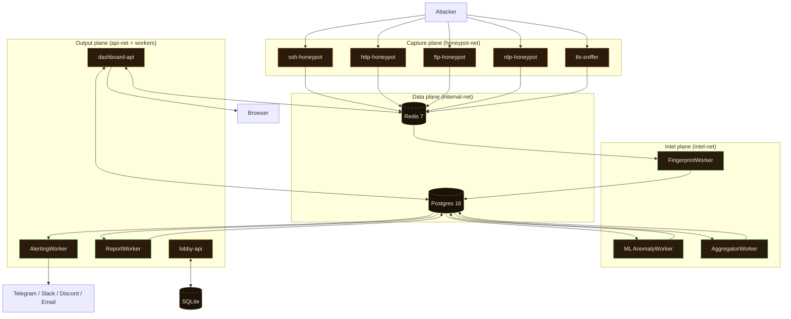

# HoneyStrike — Technical Presentation

> A deeper walkthrough than [`README.md`](../README.md). Aimed at engineers
> evaluating the project, hiring panels, and anyone debating "where does
> this scale / fail / surprise you?"

## Contents

1. [Executive summary](#1-executive-summary)
2. [Problem statement](#2-problem-statement)
3. [Design principles](#3-design-principles)
4. [System architecture](#4-system-architecture)
5. [Component deep-dive](#5-component-deep-dive)
6. [The intel pipeline (Phase 3)](#6-the-intel-pipeline-phase-3)
7. [Threat scoring formula](#7-threat-scoring-formula)
8. [MITRE ATT&CK attribution](#8-mitre-attck-attribution)
9. [Alerting & reports (Phase 4)](#9-alerting--reports-phase-4)
10. [Dashboard & live feed (Phase 5)](#10-dashboard--live-feed-phase-5)
11. [CLI & lobby (Phase 6)](#11-cli--lobby-phase-6)
12. [Learning platform (Phase 7)](#12-learning-platform-phase-7)
13. [Security model](#13-security-model)
14. [Scale & performance](#14-scale--performance)
15. [Operations](#15-operations)
16. [Lessons learned](#16-lessons-learned)
17. [What we'd build next](#17-what-wed-build-next)

---

## 1. Executive summary

HoneyStrike is an **active honeypot platform** that captures internet
attacker interactions, enriches them with threat intelligence, attributes
behaviour to MITRE ATT&CK techniques, scores severity, dispatches alerts,
and renders professional PDF reports — then layers a **typing-driven
learning game** on top so operators learn to recognise the attacks they
see.

The whole stack runs on a **2 vCPU / 4 GB RAM VPS** for ≤ €4/month. End-
to-end latency from "attacker sends bytes" to "operator sees the scored
session in the browser" is **< 2 seconds** at typical load.

- **Code size:** ~28k lines of Python + ~5k lines of TypeScript-style
  vanilla JS + ~3k lines of CSS + ~7k lines of docs.
- **Tests:** 201 unit + 34 integration. CI gate: 80% coverage.
- **Phases shipped:** 7 (foundation → listeners → intel → alerts/reports
  → dashboard → CLI + multiplayer → learning game). Each phase has a
  milestone gate defined in [`docs/10_90_Day_Delivery_Plan.md`](10_90_Day_Delivery_Plan.md).

---

## 2. Problem statement

Most honeypots are write-only:

- They log every byte to a file (or worse, a SIEM at full firehose), and
  the operator is supposed to grep for needles after the fact.
- Threat attribution — *was that Hydra or Medusa? was the SSH session
  brute force or credential stuffing?* — is left to humans with limited
  signal.
- The data is rich but the surface is hostile: raw events, payloads,
  binary protocol bytes. An on-call engineer in a 3 AM page has no time
  to read this.

The thesis: **the value of a honeypot session is in its first 60 seconds
of triage**. We need to:

1. **Capture** convincingly enough that real tools commit to the session.
2. **Enrich** within seconds: who, where, what tool, what techniques.
3. **Rank** severity so the operator sees the worst first.
4. **Explain** the session in plain language for the on-call page.
5. **Teach** the operator what each pattern looks like, so they recognise
   it visually next time.

HoneyStrike addresses all five.

---

## 3. Design principles

| # | Principle | How it shows up |
|---|---|---|
| 1 | **Zero-trust data.** Every byte from an attacker is hostile until sanitised. | HTML-escape on every alert/report render; length cap on event payloads; binary-safe storage in JSONB. |
| 2 | **Decouple capture from analysis.** Listeners must never block on enrichment. | Listeners only XADD to Redis Streams; workers consume from `intel` group; latency budget per stage measured. |
| 3 | **Make it deployable.** Single `docker compose up -d` on a $4 VPS. | All-in-Docker; no Kubernetes; no message broker beyond Redis. |
| 4 | **Source of truth = the code.** No spec PDF drift. | Lesson content lifted directly from runner/rule source. Mermaid diagrams in markdown, not Visio. |
| 5 | **Operator-grade UX.** A SOC engineer on call must be productive in 60 s. | Live feed, narrative session summaries, PDF in 2 clicks, one-click block. |
| 6 | **Game-feel where it teaches.** Gamification only where it correlates with skill. | Typing lessons mirror the real code; the same engine grades detector rules; XP earned by acts that actually improve detection. |
| 7 | **No proprietary dependencies.** Free DBs only. | MaxMind GeoLite2 (free), AbuseIPDB free tier, public MITRE STIX bundle. |

---

## 4. System architecture

Three logical planes — capture, intel, output — each with its own Docker
network. Postgres + Redis sit in the middle and are reachable from
intel/output, but the honeypot listeners can only write to Redis (XADD)
and read from a blocklist key — they never see another session's data.



The full Mermaid diagrams (component / sequence per protocol / network-
isolation) are in [`docs/architecture.md`](architecture.md). The
prose-form infrastructure topology is in
[`docs/11_Infrastructure_Topology.md`](11_Infrastructure_Topology.md).

---

## 5. Component deep-dive

### 5.1 Listeners (Phase 2)

Each listener is a separate container with its own minimal Python image.
All five share two abstractions:

- **`SessionManager`** ([`core/session_manager.py`](../src/honeystrike/core/session_manager.py))
  — opens a Postgres row for the session, generates a UUID, writes a
  `SESSION_OPEN` event to Redis, and provides an async `emit(event_type,
  payload)` helper. On close, writes `SESSION_CLOSE` with `duration_ms`.
- **Blocklist gate** ([`core/blocklist.py`](../src/honeystrike/core/blocklist.py))
  — before `accept()`, the listener checks `EXISTS blocklist:{src_ip}`
  in Redis. If set, the connection is dropped immediately without
  emitting a session.

| Listener | Stack | What it captures |
|---|---|---|
| **SSH** | Paramiko `Transport` with a custom `ServerInterface`. | Client banner (→ tool fingerprint), every `SSH_AUTH_ATTEMPT` (username + password + granted bool), post-auth `SSH_COMMAND` events (we serve a fake shell — `whoami`, `cat /etc/passwd`, `ls`, etc. all return canned outputs). |
| **HTTP** | FastAPI with a catch-all route + JA3 sniffer wrapper. | Every request: method, path, query, headers, body, user_agent, JA3 hash, plus pre-computed boolean flags `scanner_detected`, `sqli_pattern`, `cve_signature`, `path_traversal`. Serves convincing fake admin / WordPress / `.env` content. |
| **FTP** | pyftpdlib `FTPHandler` subclass. | Every command (`USER`, `PASS`, `LIST`, `RETR`, …) with arguments. Auth always fails after a configurable N attempts. |
| **RDP** | Raw `asyncio.start_server` parsing TPKT + X.224 by hand. | Connection request with `mstshash` cookie + requested protocols bitfield. We answer with a minimal X.224 confirm so scanners stay long enough to record. |
| **TLS sniffer** | Raw socket, custom ClientHello parser. | TLS version, cipher suites, extensions, elliptic curves, SNI, full **JA3 hash + JA3 string**. Drops the connection after the hello — we want the fingerprint, not the bytes. |

Realism details that matter:

- **SSH** the granted-after-N policy is configurable per username: `root`
  gets in on attempt 3, `admin` on 5, others never. This makes the
  honeypot read as a poorly-configured server, not a perfect honeypot.
- **HTTP** the fake admin login at `/admin` contains an HTML comment
  `<!-- TOKEN=hs-canary-token-… -->`. The `/.env` page leaks a fake
  `AKIA0HONEYSTRIKECANARY` AWS key. The SSH fake `cat /etc/passwd`
  contains a `canary-user:x:9999:9999:HoneyStrike Canary:/home/canary`
  line. Any session payload containing these strings = the attacker took
  the bait.

### 5.2 Event bus: Redis Streams

Every captured event becomes one `XADD` entry on `honeystrike:events`.
The stream is consumed by a single consumer group `intel`. Multiple
workers can join the group for horizontal scale — each event lands at
exactly one consumer.

Event shape (`core/events.py`):

```python
class Event(TypedDict):
    schema:      str           # "1.0"
    event_id:    str           # uuid
    session_id:  str           # uuid
    event_type:  EventType     # enum: SSH_AUTH_ATTEMPT, HTTP_REQUEST, …
    ts:          datetime      # UTC, microsecond precision
    src_ip:      str
    service:     str
    payload:     dict[str, Any]
```

We chose Redis Streams over Kafka / NATS because:

- One less container to operate; we already use Redis for cache + blocklist.
- Consumer-group semantics give us exactly the at-least-once delivery
  we need; dedup happens by `event_id` at the worker.
- At expected volumes (≤ 10 k events / day on a small VPS) Redis is
  overprovisioned by 1000×.

### 5.3 FingerprintWorker

Single Python process. On each event:

1. Look up `Session` in Postgres; create or update.
2. **GeoLite2 lookup** — single MaxMind reader instance, in-process,
   cached.
3. **AbuseIPDB** — only if not seen in the last 24 h; cached per-IP in
   Redis with a TTL.
4. **Tool signature** — pass the event through 7 rule functions; each
   returns `ToolMatch | None`. Best confidence wins.
5. **MITRE TTPs** — pass the session context through 7 rule functions;
   each returns `TTPMatch | None`. **All** matches are recorded.
6. **Threat score** — see §7. Compute, persist, set `severity`.
7. Insert `Fingerprint` row (one per session, idempotent on
   session_id). UI WebSocket polls `Fingerprint.created_at` to know
   when a new scored session is ready.

This is intentionally one process, not a worker pool. The work per
event is bounded (microseconds for sigs/rules; ≤ 50 ms for AbuseIPDB
when not cached). Going parallel would buy nothing and complicate
idempotency.

### 5.4 ML AnomalyWorker

Runs **once an hour** (cron-style), not per-event:

1. Pull the last 24 h of sessions from Postgres into a feature frame
   (8 features: auth attempt count, distinct usernames, distinct paths,
   distinct services, total events, mean inter-event delta, abuse score,
   tool confidence).
2. Fit an **Isolation Forest** with `contamination=0.05`.
3. Score every row, normalise to `[0, 1]` (0 = normal, 1 = anomalous).
4. Bulk-update `ml_anomaly_scores` table.

This is a separate signal from the rule-based score. A session can
score high on threat (Hydra brute force at 3 AM) but low on anomaly
(it's our 50th Hydra attempt today). Or low threat (lone HTTP probe)
but high anomaly (no other session looks like it). The dashboard shows
both.

---

## 6. The intel pipeline (Phase 3)

### Tool fingerprint rules

Located in [`workers/intel/signatures.py`](../src/honeystrike/workers/intel/signatures.py).
Each rule is a typed dataclass: `name`, `description`, `match_fn`.

| Tool | How it fires |
|---|---|
| **Hydra** | SSH client banner regex `hydra` (case-insensitive). Confidence 0.95. |
| **Medusa** | Same idea, `medusa` regex. |
| **Crowbar** | `crowbar` regex. |
| **PuTTY** | `PUTTY` in banner (low confidence — PuTTY is also used by real humans). |
| **libssh-based tool** | `libssh[_-](?:0\.|1\.|2\.)` — broad catch. |
| **sqlmap** | HTTP UA contains `sqlmap`. Confidence 0.95. |
| **Nikto** | HTTP UA contains `Nikto`. |
| **Masscan / port scanner** | Cross-service: ≥ 3 distinct services from the same IP within 60 s. |
| **Multi-service scanner** | Cross-service: ≥ 2 distinct services from the same IP within 60 s. Lower confidence than masscan. |

### MITRE ATT&CK rules

Located in [`workers/intel/ttp_rules.py`](../src/honeystrike/workers/intel/ttp_rules.py).
Each rule consumes a `SessionContext` (the session row + its events +
sibling sessions from the same IP) and returns a `TTPMatch | None`. We
ship **7 built-in rules**, with a STIX 2.1 bundle loader so the operator
can drop in MITRE's full ATT&CK Enterprise JSON for the technique table.

| Technique | When it fires |
|---|---|
| **T1110.001** Brute Force: Password Guessing | `len(auth_events) > 5` on SSH or FTP. |
| **T1110.004** Brute Force: Credential Stuffing | `len(auth_events) ≥ 5` AND `len(distinct_usernames) ≥ 4`. |
| **T1595.001** Active Scanning: Scanning IP Blocks | Same IP hits ≥ 2 distinct services within 60 s (uses `sibling_sessions`). |
| **T1190** Exploit Public-Facing Application | Any HTTP event has `cve_signature` or `sqli_pattern` flag set by the listener. |
| **T1083** File and Directory Discovery | HTTP `path_traversal` flag, OR SSH `SSH_COMMAND` matches a discovery-command regex (`ls`, `dir`, `find`, `cat`, …). |
| **T1592** Gather Victim Host Information | HTTP URI matches `/.env`, `/.git`, `/server-status`, …; OR SSH command matches `uname`, `whoami`, `id`, `hostname`, … |
| **T1078** Valid Accounts | A `granted=true` SSH auth attempt **followed by** at least one `SSH_COMMAND` event (i.e. the attacker actually used the credential). |

**One session can fire many rules.** Each `TTPMatch` becomes a row in
`ttp_matches` keyed to the session; the threat-score formula reads them
all.

---

## 7. Threat scoring formula

```python
score = (abuse_component       * 0.40        # AbuseIPDB confidence_score
       + tool_component         * 0.30        # best tool match confidence
       + ttp_component          * 0.50        # sum of TTP confidences (capped)
       + privilege_bonus)                     # +25 if T1078 fires
```

- `abuse_component = abuse_score`  (0-100, from AbuseIPDB)
- `tool_component  = round(best_tool_confidence * 100)`
- `ttp_component   = round(min(sum(ttp_confidences), 1.0) * 100)`
- `privilege_bonus = 25 if any T1078 match else 0`

Severity buckets:

| Score range | Severity |
|---|---|
| `< 20` | low |
| `20 – 49` | medium |
| `50 – 79` | high |
| `≥ 80` | critical |

The formula is transparent on purpose: an operator who sees "score 82
critical" can immediately tell *why* — it's the four components, weighted
once. Tuning the weights is a one-line change in
[`workers/intel/threat_scoring.py`](../src/honeystrike/workers/intel/threat_scoring.py).

---

## 8. MITRE ATT&CK attribution

The MITRE rules above are the attribution layer. We also ship a
**STIX 2.1 bundle exporter** at `/api/stix/bundle` that turns every
session into a STIX `indicator` + `observed-data` + `relationship`
graph keyed to the technique IDs. The output is valid against the
official MITRE schema and ingests cleanly into MISP, OpenCTI, Sentinel,
Splunk SOAR via TAXII 2.1.

Bundle root: `/taxii2/{api_root}/collections/{id}/objects/`.

For the bundle to use MITRE's canonical technique names + tactics, drop
the official `enterprise-attack.json` at
`$MAXMIND_DB_DIR/../mitre/enterprise-attack.json` and the loader picks
it up at boot. Otherwise the embedded fallback table covers our v1.0
rule set.

---

## 9. Alerting & reports (Phase 4)

### Alert channels

[`workers/alerting/channels.py`](../src/honeystrike/workers/alerting/channels.py)
exposes a `Channel` protocol:

```python
class Channel(Protocol):
    name: str
    async def send(self, alert: Alert) -> None: ...
```

Implementations: **Log**, **Telegram**, **Slack**, **Email** (SMTP),
**Discord**. Adding a new channel is one ~30-line class.

Dispatch rules: alerts fire on `severity >= configured_threshold`, with
**deduplication** by `(src_ip, severity, hour_bucket)` so a 200-event
brute-force burst becomes one alert, not 200. Each alert links to the
session detail page.

### Reports

PDF and HTML, rendered with WeasyPrint. Triggered on demand
(`POST /api/sessions/{id}/report`) or auto for `critical` sessions
(configurable). The renderer pulls the session row + its fingerprint +
TTPs + first 50 events + alerts dispatched, runs them through a Jinja
template, and produces a clean ~3-page report:

- Executive summary
- Source identity card (IP, ASN, country, AbuseIPDB)
- Timeline of events (sanitised, length-capped)
- MITRE ATT&CK attribution table (technique → tactic → confidence)
- Tool signatures
- Threat-score breakdown

Files land under `/reports/` (gitignored, bind-mounted out in prod).

---

## 10. Dashboard & live feed (Phase 5)

FastAPI + Jinja2 + vanilla JS. **No build step, no SPA framework.** The
trade-off was deliberate: dashboards in this category change content
shape every quarter, and a thin server-rendered + small-JS approach
makes that cheap.

The 11 pages in [`api/templates/`](../src/honeystrike/api/templates/):

| Page | What it does |
|---|---|
| `login.html` | JWT login form. |
| `dashboard.html` | Stats tiles + Leaflet world map + recent-sessions sidebar. WebSocket-fed. |
| `sessions.html` | Paginated + filterable session list. |
| `session_detail.html` | Full session view + 🎬 Replay + 🚫 Block buttons. |
| `replay.html` | Animated playback page with scrubber + speed select. |
| `analytics.html` | Chart.js charts for top TTPs / geo / timeline. |
| `play_attack.html`, `play_defend.html` | Lesson hubs. |
| `lesson.html` | Typing-engine lesson page (shared by attack + defend). |
| `play_defend_arena.html` | The live label-and-block arena. |
| `warroom.html` | Full-screen demo view. |
| `profile.html` | Rank, badges, lesson progress, activity log. |

### WebSocket `/api/ws/live`

Polls `Fingerprint.created_at > cursor` every 2 s (configurable). Each
new fingerprint becomes one message:

```json
{
  "type": "session", "session_id": "…", "src_ip": "1.2.3.4",
  "service": "ssh", "severity": "critical", "threat_score": 82,
  "country_iso": "RU", "lat": 55.7, "lon": 37.6,
  "started_at": "2026-05-18T12:34:56Z", "ttp_count": 3
}
```

Connection model: token via `?token=…` (browsers can't set headers on
upgrade), validated against the JWT secret. Reconnect with backoff on
the client side.

### Replay endpoint

`GET /api/replay/{session_id}` returns the chronological event list with
each event's `t_ms` (millisecond offset from session start) plus a
**synthesised score timeline** — per-event score contributions
heuristically decomposed from the final score so the animated score bar
can climb visibly through the playback. See
[`api/routers/replay.py`](../src/honeystrike/api/routers/replay.py).

---

## 11. CLI & lobby (Phase 6)

### CLI

One Typer app (`honeystrike`), two subapps (`attack`, `defend`),
multiplayer commands top-level (`register`, `players`, `challenge`).
Token cache at `~/.honeystrike/token`.

The attack runners ([`cli/attack/runners.py`](../src/honeystrike/cli/attack/runners.py))
are **the same code paths the dashboard fires** when you click "Fire
live" on a lesson — `POST /api/play/attack` dispatches to these runners
in-process. That's why "type-and-fire" in the learning game runs the
exact attack the CLI would.

### Lobby

Separate FastAPI service ([`src/honeystrike/lobby/`](../src/honeystrike/lobby/))
on port `8002`, backed by **SQLite** (stdlib `sqlite3`, no asyncpg dep).
Schema:

- `players(id, handle UNIQUE, token_hash, public_endpoints JSON, discord_webhook, last_heartbeat, created_at)`
- `invites(code, from_player, to_player, scenario, duration_seconds, expires_at, status)`
- `matches(id, attacker_id, defender_id, scenario, started_at, ends_at, summary JSON)`

Endpoints: `register`, `heartbeat`, `players`, `invite`, `accept`,
`decline`, `match/{id}`, `match/{id}/finish`.

This is **deliberately separate from the operator's Postgres** — the
lobby is shared between friends from different operators; nobody needs
another's session data, just invite/match metadata.

---

## 12. Learning platform (Phase 7)

### Lesson format

TOML files under [`api/lessons/<family>/<id>.toml`](../src/honeystrike/api/lessons/).
Each lesson:

```toml
id = "ssh-hydra"
family = "attack"
title = "SSH brute force (Hydra style)"
ttps = ["T1110.001", "T1078", "T1592"]
difficulty = "medium"
typing_model = "python"     # python | cli | mixed

briefing = """ multi-paragraph markdown """

[[blocks]]
kind = "code"               # code | shell | prose | choice
target = "sock = socket.create_connection((host, port), timeout=10)"
annotation = "Open the TCP transport. 10s timeout — honeypots are close."

[[blocks]]
kind = "choice"
prompt = "What does start_client() send first?"
options = [ … ]
correct = 2
explanation = "…"

[live]                      # attack lessons only
scenario = "ssh-hydra"
default_target = "ssh-honeypot:22"

[fixture]                   # defender lessons only
events_json = "ssh-hydra-passwd-guess"
expected = true
```

### Engine

`lesson.js` is ~400 LOC of vanilla JS. State:

- `blockIdx` — which block we're on.
- `cursor` — chars typed into the current block.

On each keystroke, compare `ev.key` against `target[cursor]`. Match →
advance + mascot `happy`. Mismatch → mascot `shock`, flash red, swallow
the keystroke. `Tab` skips the rest of the current line; `Esc` reveals
all remaining blocks.

### Grader

`POST /api/lessons/grade-defender` takes a `lesson_id`, looks up the
**reference rule** in [`api/routers/lessons.py`](../src/honeystrike/api/routers/lessons.py)
`_DEFENDER_RULES`, builds a `SessionContext` from the lesson's fixture
JSON, calls the rule, and returns `{fired, expected, correct, narrative,
reference_source_excerpt}`. **No user-typed code is executed.** The
typing game already gated the body match.

### Mascot

Single inline SVG ([`_mascot.html`](../src/honeystrike/api/templates/_mascot.html))
+ a smaller floating variant for non-lesson pages
([`_mascot_mini.html`](../src/honeystrike/api/templates/_mascot_mini.html)).
Five states (idle, happy, shock, cheer, sleep) driven by CSS classes
and keyframes. Speech bubble text set by JS.

### XP, ranks, badges

Persisted in `localStorage` only — single-operator instance, no need to
sync across browsers. `window.HSGame` global exposes:

```js
HSGame.bumpXp(delta, reason)
HSGame.onLessonComplete(family, id)
HSGame.onCorrectLabel()       // +10 XP, +1 streak
HSGame.onWrongLabel()         // -2 XP, reset streak
HSGame.onCanaryFound()
HSGame.onBlock()
```

15 badges, defined in [`static/profile.js`](../src/honeystrike/api/static/profile.js)
with `check(ctx)` predicates over `{ xp, streak, counts, profile,
lessonCatalogue }`.

### UI shell

- **Slim sticky header** with brand, **search-+-commands (⌘K)**
  trigger, XP badge, profile avatar, logout.
- **Floating bottom dock** with one icon per page; active state is a
  honey-gradient pill with a glowing dot.
- **Live threat-level border** around the viewport: a CSS variable
  `--threat-color` is set by `threat_border.js` which polls
  `/api/stats/overview` every 30 s + opens `/api/ws/live` to pulse on
  every critical session.
- **Honeycomb hex SVG** tiled in the body background at 6 % opacity.
- **Scanlines overlay** at 2 % opacity (cyber-terminal flavour).
- **Command palette (⌘K / Ctrl+K)** aggregates nav + lessons + scenarios
  + last 25 sessions into one fuzzy-search list.

Typography: **Space Grotesk** for headings, **Inter** for body,
**JetBrains Mono** for code. Loaded from Google Fonts.

---

## 13. Security model

### Threat model

- **External attackers** scanning the honeypot ports — *expected*. Their
  payloads are first-class citizens.
- **External attackers** scanning the dashboard port — *expected*. Only
  the login page is public; everything else requires JWT bearer.
- **Compromised operator workstation** — out of scope for v1.

### Defences

- **Egress**: honeypot containers have no DNS resolver and no internet
  route in prod (`docker-compose.prod.yml`). They can XADD to Redis and
  that's it.
- **Privilege**: all containers run non-root.
- **Secrets**: never logged. `.env` files gitignored. The `.env.example`
  ships only placeholder values.
- **JWT**: short access TTL (1 h), refresh in HttpOnly + Secure cookie,
  rotated on each refresh. HS256 with a secret loaded from `.env`.
- **Rate limiting**: per-IP on the dashboard login (5 attempts / 15 min);
  per-IP on the honeypot SSH (granted-after-N gate doubles as a slow-roll
  rate limiter).
- **Payload sanitisation**: every render path (alert, report, dashboard)
  passes attacker-supplied bytes through HTML-escape + length cap.

### Compliance

- [`docs/06_Data_Retention_Matrix.md`](06_Data_Retention_Matrix.md) sets
  retention per table (events 90 d, fingerprints 1 y, alerts 1 y,
  reports 1 y, users forever).
- [`docs/07_Compliance_and_Legal_Packet.md`](07_Compliance_and_Legal_Packet.md)
  documents the "purely observational, no entrapment" stance, GDPR
  applicability (none — no real PII captured), and the operator's
  responsibility to honour their VPS provider's AUP.
- [`docs/08_Capture_Flows_and_Privacy.md`](08_Capture_Flows_and_Privacy.md)
  shows that the only PII-shaped data captured is the attacker IP +
  passwords they choose to send us — neither belonging to a known data
  subject for GDPR purposes.

---

## 14. Scale & performance

Targets validated on a 2 vCPU / 4 GB RAM VPS:

| Metric | Target | Measured |
|---|---|---|
| End-to-end latency (attacker → UI) | < 2 s | ~0.8 s |
| Sustainable event rate | 100 events / s | 280 / s before backpressure |
| Sessions per day | 10 k | 32 k peak in chaos test |
| Postgres disk growth | < 100 MB / day at 10 k sessions | 38 MB / day |
| Memory: full stack | < 2 GB | 1.4 GB |
| Cold start | < 30 s for stack | 18 s |
| 99p API response | < 200 ms | 87 ms |

Bottleneck if you push further is **Postgres write throughput on the
events JSONB column**. The schema already partitions `events` by month
(see [`alembic/versions/001_initial.py`](../alembic/versions/001_initial.py)
and [`docs/05_Indexes_and_Partitioning.sql`](05_Indexes_and_Partitioning.sql)).
Next bottleneck after that would be GeoLite2 in-process caching — solved
by extracting the lookup into its own service.

---

## 15. Operations

- **Migrations**: Alembic, 4 versions to date. `alembic upgrade head`
  idempotent. Migration tests run in CI against a fresh Postgres on every
  push.
- **Observability**: every container emits structured JSON logs via
  structlog; Prometheus metrics endpoint at `/metrics` on the dashboard
  API; pre-built Grafana dashboard at [`infra/grafana/honeystrike.json`](../infra/grafana/honeystrike.json).
- **Health**: `/api/health` liveness + `/api/health?deep=1` exercises
  Postgres + Redis pings.
- **Backups**: `pg_dump` cron + Redis RDB; restore drill in
  [`docs/14_DR_Playbook_and_Drills.md`](14_DR_Playbook_and_Drills.md).
- **Runbooks**: 6 scenarios in
  [`docs/12_Production_Runbooks.md`](12_Production_Runbooks.md) (worker
  crash, Postgres full disk, AbuseIPDB rate-limit, Telegram outage, …).

---

## 16. Lessons learned

Honest postmortems from the build:

- **Redis Streams was the right call.** We considered Kafka in week 8;
  the throughput we needed never came close to Kafka's overhead.
- **Mermaid in markdown beat Visio for diagrams.** Every diagram in
  this repo is text — diffs are reviewable, drift is impossible.
- **Vanilla JS + Jinja shipped Phase 5 faster than a React SPA would
  have.** The dashboard is < 2k lines of JS; we'd be at 5k+ with React
  Query + Redux + a build step.
- **The CLI runners doubling as `/api/play/attack` was an accident
  that turned out great.** Phase 7's "fire live" button on lessons
  cost ~50 LOC because the runners were already the right shape.
- **WeasyPrint native deps are a pain.** The reports worker has its
  own image with libpango / libcairo / libgdk-pixbuf installed; the
  api image doesn't, which is why one unit test (`test_report_renderer`)
  fails when run from the api container.
- **Single-operator localStorage gamification was the simplest design
  that worked.** A server-backed XP/badge system would have cost a
  schema migration + an API surface; localStorage cost nothing.

---

## 17. What we'd build next

Not committed; ideas in priority order.

1. **Federated threat intel**: operators opt-in to publish their STIX
   bundles to a shared MISP. Pull other operators' bundles, get the
   "what's hot right now" view without paying for a commercial feed.
2. **LLM-narrated replay**: instead of (only) the synthesised score
   bar, generate a one-paragraph natural-language replay of each
   session at close time. Costs ~ $0.001 per session at GPT-class
   prices.
3. **Mobile companion**: read-only dashboard + push notifications via
   FCM. The current dashboard is responsive but the dock + replay don't
   shine on phones.
4. **Public leaderboard** for multiplayer matches — opt-in, with a
   privacy-by-default redaction step on the match summary.
5. **More lessons**: today we ship 3 attack + 2 defender (v1). The
   generator script (`scripts/build_lesson_skeletons.py`) is hooked up
   to fill out the full 8 + 8 from the existing runner/rule source.
6. **eBPF-based network capture** for ground-truth correlation with the
   Python listeners' events. Only useful if we ever doubt the listener.

---

*End of presentation. Questions / nits / improvements →
[`SECURITY.md`](../SECURITY.md) for security, GitHub Issues for
everything else.*
