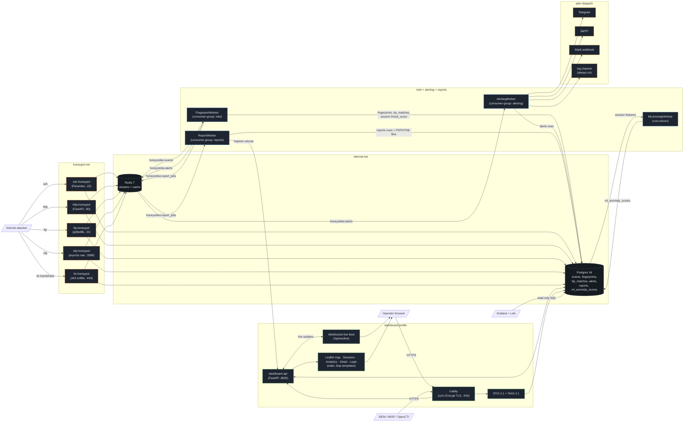
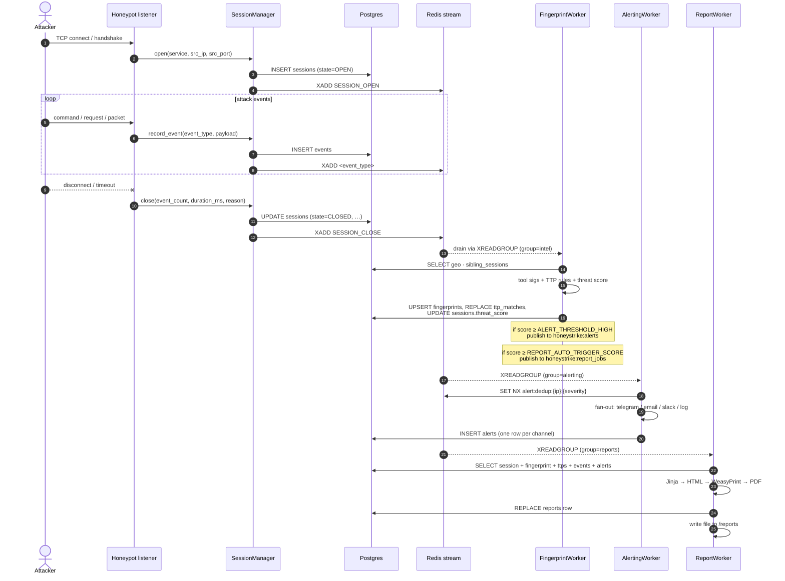
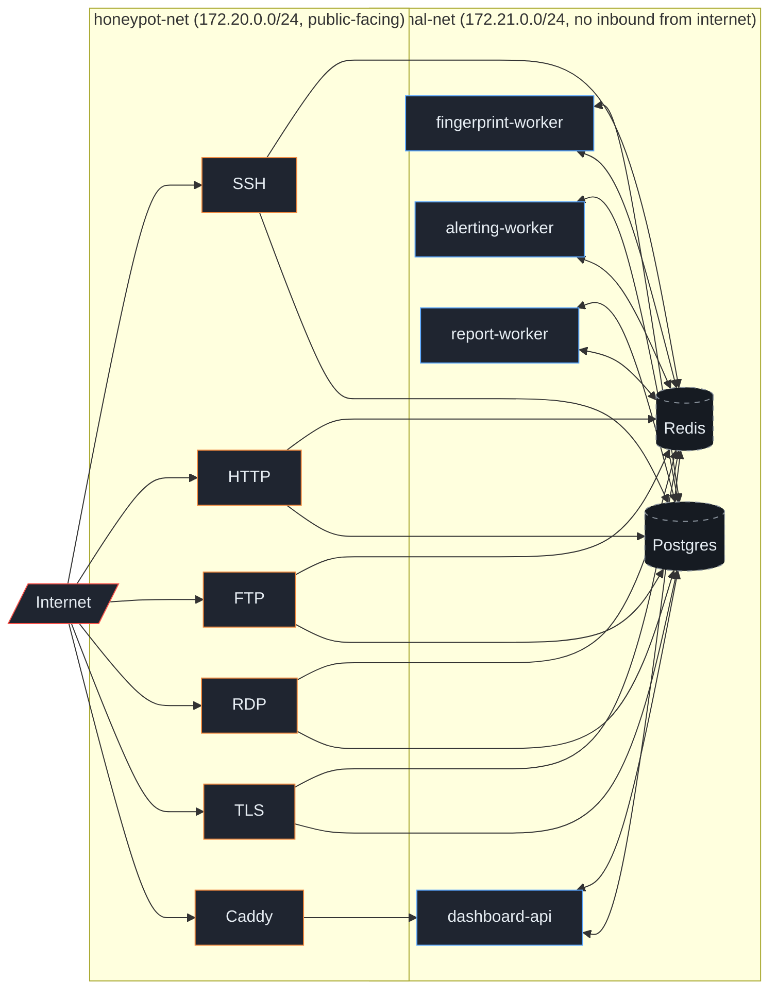

# HoneyStrike — Architecture

Authored as Mermaid in lieu of `architecture.drawio` (a binary editor artefact); these diagrams render natively in GitHub, are diffable in git, and stay in sync with the code far more reliably than an exported PNG.

For prose, see [`01_SPEC_Master.md`](01_SPEC_Master.md) and [`11_Infrastructure_Topology.md`](11_Infrastructure_Topology.md).

---

## 1. Component view

---

## 2. Per-session lifecycle

---

## 3. Network isolation (prod, --profile dashboard)

Postgres and Redis are never on `honeypot-net` — a compromised honeypot process can publish to Redis and call into Postgres via SQLAlchemy on `internal-net`, but cannot serve those datastores publicly. UFW on the VPS only opens 22 / 80 / 443 / 21 / 3389 / 8443 inbound; the management SSH port is locked to the operator IP.

---

## 4. Streams + consumer groups

| Stream | Producer(s) | Consumer group | Consumer |
|---|---|---|---|
| `honeystrike:events` | every honeypot listener (via `SessionManager`) | `intel` | FingerprintWorker |
| `honeystrike:alerts` | FingerprintWorker (when score ≥ threshold) | `alerting` | AlertingWorker |
| `honeystrike:report_jobs` | FingerprintWorker auto-trigger + `POST /api/sessions/{id}/report` | `reports` | ReportWorker |

Streams use Redis's `XADD … MAXLEN ~` cap so the backlog is bounded; consumer groups give every worker exactly-once semantics under graceful restart. Re-delivery during crash recovery is idempotent because every persistence path (`fingerprints`, `ttp_matches`, `reports`) uses `ON CONFLICT (session_id) DO UPDATE` or `DELETE + INSERT`.
